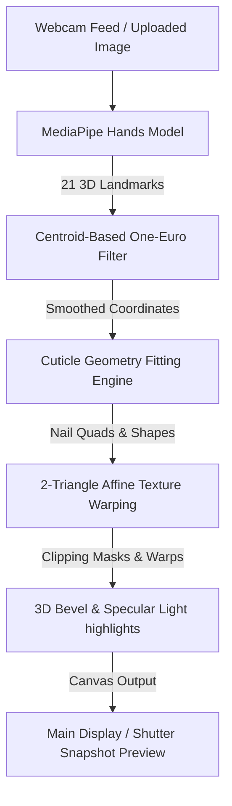

# 💅 NailAR Pro — Professional Real-Time AI Virtual Try-On Studio

NailAR Pro is a premium, client-side, zero-install virtual nail salon featuring real-time AI-powered hand mesh tracking, snug fingernail cuticle fitting, 5 dynamic programmatic shape masks, and robust custom nail art texture uploads. 

This repository implements a lightweight, high-performance **HTML5 + Vanilla CSS3 + JavaScript (ES6)** single-file pipeline leveraging external CDNs for MediaPipe. It guarantees sub-10ms frame latency and is fully optimized for both desktop and mobile web viewports.

---

## 🌐 Deployed App & Live Links
* **Repository Link:** [https://github.com/BEULAHDEVA/Nailtryon.git](https://github.com/BEULAHDEVA/Nailtryon.git)
* **Local Server Primary Port:** `http://localhost:3000/nail-tryon.html`
* **Alternate Subdirectory Port:** `http://localhost:3000/nailARt-app/nail-tryon.html`

---

## 📐 Architecture & Pipeline Flowchart

The system handles real-time video frames and custom uploads using a highly optimized synchronous mathematical rendering loop:



---

## 🧩 Core Architectural Components

### 1. AI Hand Tracking Landmark Subsystem
* **Core Technology:** `@mediapipe/hands` (Loaded dynamically via jsDelivr CDN to bypass heavy Next.js/bundler node compiling restrictions).
* **Tracking Strategy:** Establishes a highly stable **21-landmark 3D hand mesh coordinate system** at 30-60 frames per second.
* **Optimization:** Custom facing-mode mirror translation. Mirrors landmark x-coordinates (`1.0 - x`) only when using front-facing cameras, keeping static photo uploads completely unmirrored.

### 2. Centroid-Based One-Euro Smoothing Filter
* **Class Implementation:** `OneEuroFilter1D` and `LandmarkSmoother`.
* **Strategy:** Leverages a double exponential filter that adapts its smoothing cutoff frequency dynamically based on hand motion speed.
* **Benefit:** Eliminates high-frequency tracking jitters when the hand is still, yet responds instantly with zero tracking lag when the user moves their fingers.

### 3. Calibrated Cuticle Fitting & Geometry Engine
* **landmark Anchoring:** The base cuticle segment is calculated using the PIP, DIP, and TIP landmarks for all 5 fingers (Thumb, Index, Middle, Ring, Pinky).
* **Segment Fitting Ratio:** Calibrated to cover the natural nail bed seamlessly. Sets the base cuticle center at `-0.55 * segment length` from the tip, and the free-edge tip at `0.15 * segment length`, extending nails elegantly without covering the DIP knuckle joint.
* **Width Ratio:** Proportions are set at a natural default width segment ratio of `0.32`, ensuring a snug, full-coverage side-to-side fit.

### 4. Zero-Seam 2-Triangle Affine Warping
* **affine Transformation:** Maps texture coordinates (`sTL, sTR, sBL, sBR`) onto the dynamic destination landmarks quad (`TL, TR, BL, BR`) using a fast 2D linear matrix equation (`computeAffine`).
* **Diagonal Seam Resolution (Fixed Seam Line!):** Adjacent 2D triangle rasterization typically leaves a visible 1-pixel diagonal seam where triangles meet. NailAR Pro solves this by dynamically calculating the **centroid** of the triangles and expanding all three vertices outward by **`0.85` pixels** (`expandVertex`). This ensures a microscopic overlap that completely covers the seam, rendering a flawless, seamless texture!

### 5. Spectroscopic Specular Gloss & Spotlighting
* **bevel Contour Blend:** Anti-aliased vector clipping path mask conforms perfectly to the selected shape.
* **Gloss highlights:** Programmatically generates a linear specular gradient starting at the top mid tip and feathering out at `32%` nail length.
* **Spotlight Flare:** Draws a radial spot reflecting glare off light sources (`globalCompositeOperation = 'screen'`), blending the virtual nail organically with natural lighting conditions.

### 6. Dynamic Programmatic Nail Shapes
The canvas clipping path (`buildNailClipPath`) uses custom Bezier path logic to transform nail silhouettes programmatically in one tap:
* **Oval:** Classically rounded tip.
* **Square:** Straight parallel sidewalls with a flat, squared tip.
* **Almond:** Slender, tapered sidewalls curving into a rounded point.
* **Coffin:** Highly tapered sidewalls leading to a narrow, flat square tip.
* **Stiletto:** Sharp, dramatic pointed tip.

### 7. Custom Uploaded Design Texture Pipeline
* **High-Fidelity Auto-Crop:** The upload input intercepts files and scans them on a temp canvas (`detectDesignBoundingBox`). It identifies content boundaries (ignoring transparent or white space margins) and automatically crops the image to that bounding box to prevent tiny, misplaced overlays.
* **Smart White-Keying Transparent Filter:** Automatically scans pixel matrices. If it detects a solid white background (>12% of pixels are white), it keys out white pixels to full transparency, transforming normal JPG designs into clean transparent overlays instantly.
* **Texture Orientation Flip:** Automatically translates and scale-flips the texture canvas vertically so the design faces the fingertips naturally.
* **Carousel Integration:** Prepend uploaded nail art as a first-class `"Custom Art"` design with a live thumbnail inside `NAIL_CATALOGUE`, updating the UI instantly!

---

## 🎨 Programmatic Art Designs Carousel
The app features **17 beautiful, high-fidelity styles** generated programmatically on standard canvases:
1. **Hailey Glazed Donut:** Soft pearlescent soft glaze white.
2. **Emerald Velvet:** Deep velvet emerald green with a glowing cat-eye magnetic stripe.
3. **Ruby Glitter:** Rich luxury red jewel with high-intensity gold and red sparkles.
4. **Milky White:** Clean translucent semi-sheer chic white.
5. **Cyber Glitch:** Neon laser scan-lines over a dark midnight backdrop.
6. **Nude Minimal:** Graceful neutral beige with an elegant vertical gold stripe.
7. **French Classic:** Timeless warm nude base with a clean white arc tip.
8. **Hot Pink Gel:** Vibrant neon pink with radial depth shading.
9. **Chrome Silver:** Multi-band diagonal reflective metallic silver.
10. **Midnight Black:** Matte black base with micro-shimmer glitter.
11. **Rose Ombre:** Romantic vertical pink-to-beige gradient.
12. **White Marble:** Off-white background with gray and thin gold veins.
13. **Holographic:** Diagonal iridescent rainbow with linear sheen.
14. **Gold Glitter:** Gold base with high-density gold and white glitter.
15. **Sage Mist:** Pastel sage green with subtle watercolor washes.
16. **Coral Blush:** Vibrant coral with horizontal screen highlights.
17. **Lavender Dream:** Ethereal lavender base with rich purple shimmer.

---

## ⚙️ Local Development Settings
Since the application uses standard browser features, you only need to run a static local server:

1. **Serve Files locally:**
   ```bash
   npx --yes serve -l 3000 .
   ```
2. **Access the App:**
   * Open `http://localhost:3000/nail-tryon.html` in your browser.
